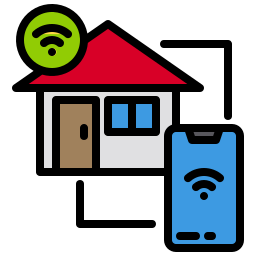

[![License][license-shiled]][license-link]
[![LinkedIn][linkedin-shiled]][linkedin-link]
# home-automation

<!-- PROJECT LOGO -->

 
Icons made by <a href="https://www.flaticon.com/free-icon/smart-house_2910695" title="xnimrodx">xnimrodx</a> from <a href="https://www.flaticon.com/" title="Flaticon">www.flaticon.com</a>

## Table of Contents

* [About the Project](#about-the-project)
  * [Built With](#built-with)
* [License](#license)
* [Contact](#contact)

<!-- ABOUT THE PROJECT -->
## About The Project
Bachelor final project - 2020 
[Tehničko veleučilište u Zagrebu](https://www.tvz.hr/) 
[Mechatornics](https://www.tvz.hr/studiji/mehatronika/preddiplomski)

<!-- BUILT WITH -->
### Built With
* [Flask](https://flask.palletsprojects.com/en/1.1.x/)
* [D3.js](https://d3js.org/)
* [Bootstrap](https://getbootstrap.com)
* [JQuery](https://jquery.com)
* [PostgreSQL](https://www.postgresql.org/)

<!-- LICENSE -->
## License
Distributed under the MIT License. See `LICENSE` for more information.

<!-- CONTACT -->
## Contact
hergesic.adamovic@gmail.com

[license-shiled]: https://img.shields.io/github/license/Naponoel/home-automation.svg?style=flat-square
[license-link]: https://github.com/Naponoel/home-automation/blob/master/LICENSE.txt
[linkedin-shiled]: https://img.shields.io/badge/-LinkedIn-black.svg?style=flat-square&logo=linkedin&colorB=555
[linkedin-link]: https://www.linkedin.com/in/leon-hergesic-adamovic/
